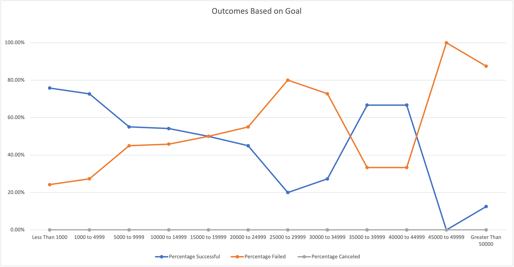
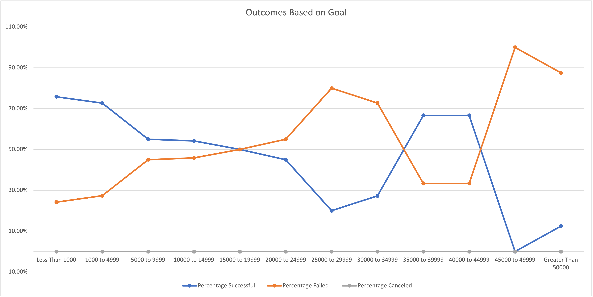

# Kickstarting with Excel

## Overview of Project

### This analysis provides two images that showcase insight on relationships between the followings:
* Theater Outcomes by Launch Months 
  * This demonstrates the number of successful, failed, and canceled cases across each months that the porject was first lauched.

* Outcome percentage based on goal.  
  * This demonstrates the percentages of outcomes across different goal brackets. 

## Analysis and Challenges
### Basic analysis and encountered challenges.

* Analysis of Outcomes Based on Launch Date
  * A pivot table with the relevant information listed in the PivotChart Fields does the analysis perfectly. Parent Category & Years in Filters box, Outcomes in the Legend box, Date Created Conversion in Axis box, and Conut of outcomes in Values box. A potential challenge to this analysis was that when "Date Created Conversion" was dragged into Axis box, we must make ensure that we're only keeping the correct information, in our case we had to remove Years2 and Qaurters out of the Axis box to get the correct analysis. Per output, May has the highest sucessful cases (111), where as December has the lower (37). 

* Analysis of Outcomes Based on Goals
  * According to analysis, the highest success rate is goal less than 1000. Goal between 45000, and 49999 has a sucess rate of 0%. In terms of failure rate, goal range between 45000~49999 is 100%. (Do keep in mind that the total projects for this goal bracket is only 1, thus more in-depth research is necessary if needed.)

* Challenges and Difficulties Encountered
  * In the second analysis, Outcome Based on Goals, at some point, it was obvious my data was not populating correctly. I was able to catch this issue because I have self-check columns to double ensure that the numbers populated in the table corresponds to the total amount pulled from the original data source. Knowing the numbers weren't outputing correctly, I went into the functions and found out there were two issues. The first issue was that I did not have quotes (") properly places in the functions. Second issue was that we must have the ranges inputted correctly. (For instance, when goal is 50000, this is placed in the "Greater than 50000" bracket.) Initially, i did not have this included, but later fixed it, and the numbers then looked correct. 

## Results
### Enlightening time. 

* What are two conclusions you can draw about the Outcomes based on Launch Date?
 * According to our data analysis, theater campaigns lauched in May tends to have highest successful cases. This sucessful cases starts to decline over the next few months.
 * Number of canceled cases are very close over the months. January has the highest failures(7) among all the months. 

* What can you conclude about the Outcomes based on Goals?
 * Analysis tells us that if an individual wants to lauch a play campaign, the optimal goal would be less than $1000, because the difference between sucesses and failures rates are the largest among all goal brackest. 

* What are some limitations of this dataset?
 * It likely that we do not have a complete dataset. 
 * There might been inaccurate data involved due to typo. 

* What are some other possible tables and/or graphs that we could create?
 * Pledged vs Average_Donation (Relationships between how much people donate on average and pledged.)
 * Outcome vs Country (In some countries, sucess cases might be higher?)

